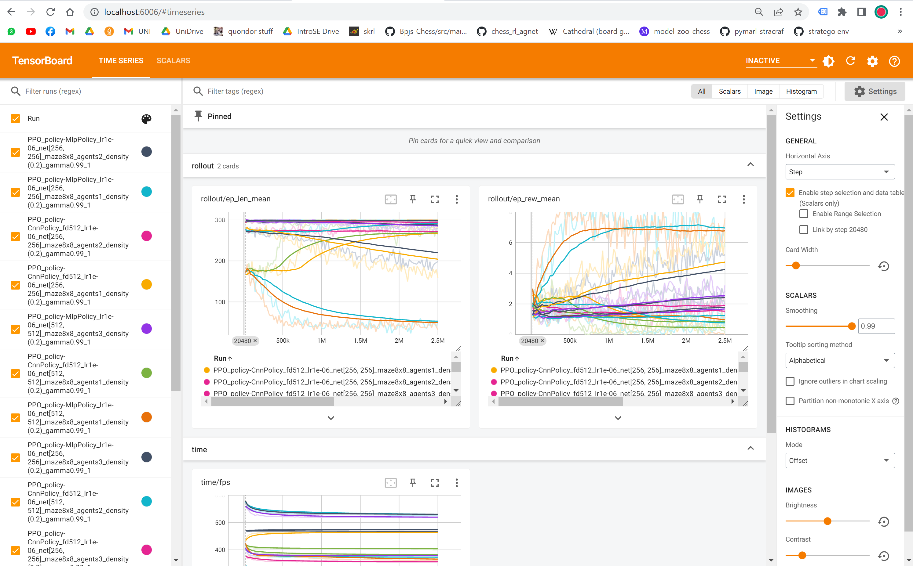

# Multi Agent Reinforcement Learning

This project compares between different observation types for the MAPF problem.
- Vectorized Representation - single vector containing all of the information of the observation
- Spatial Representation - An image that represents the observation

## Install 

Download this project or clone it to your local computer.

Then perform:
```bash
pip install -r requirements.txt
```

## Usage

There are 2 ways to use this project (training agents)
* Locally run an agent:
  * run ```train_many.py``` file and adjust the arguments as you wish
  * The description of each argument written in the ```train_vectorized.py``` file
* Run many agents on a Slurm cluster:
  * Create an environment with the requirements that are in the requirements.txt file.
  * Create a ```train_marl.sh``` file that calls the ```train_vectorized.py``` file with the argument the shell file recieved
  * Adjust what parameters you want to run for each model as shown in the ```train_many.py``` file.
  * On the cluster, run "python3 train_many.py"

The output will be a folder of tensorboard output for each model, where each folder is called ```tensorboard_vec_x``` where x is the size of the map.
This means all of the tensorboards output of models of a map of size 5 for example, will be in the same folder.

## Observe The Output

Observing the tensorboards of folder `tensorboard_vec_x` is done by (after installing the tensorboard requirement) the following command.

```bash
tensorboard --logdir tensorboard_vec_x
```

This will output a link to a local output port that can be accessed through any browser.

This is what an output should look like:

The tensorboard contains many useful insights about the RL agent's performance.

## Evaluating an RL Agent

After running the `train_vectorized.py`, each model will be saved in a `models` folder with the name representing the model's class and all of the relevant hyperparameters, maze size and number of agents in the map.

To evaluate a model, use the `evaluate_mapf_metrics.py` file.
Just insert the model's path into the model array in the start of the main function and run. This will print you 2 histograms representing the Makespan and Sum of Costs metrics, while printing the averaged total reward, sum of costs, makespan and solving ratio.